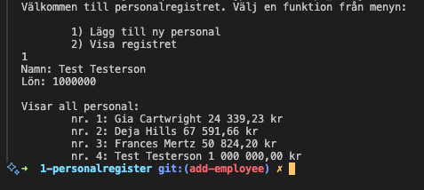

# C# Övning 1 - Personalregister
## Bakgrund
Ett litet företag i restaurangbranschen kontaktar dig för att utveckla ett litet
personalregister. De har endast två krav:
1. Registret skall kunna ta emot och lagra anställda med namn och lön. (via inmatning
i konsolen, inget krav på persistent lagring)
2. Programmet skall kunna skriva ut registret i en konsol.
## Uppgift 1
Vilka klasser bör ingå i programmet?

### `Employee`
* Håller information om enskild personal.

### `Registry`
* En samling av personal. 
* Kan visa en lista av all personal.
* Kan lägga till ny personal.
* Kan redigera information för enskild personal.
* Kan ta bort personal.

## Uppgift 2
Vilka attribut och metoder bör ingå i dessa klasser?

### `Employee`
Props:
* `int Id`
* `string Name`
* `decimal Salary`

#### `Registry`
Props:
* `string CompanyName`

Methods:
* `void DisplayAllEmployees`
* `void AddEmployee(Employee newEmployee)`
* `void EditEmployee(int employeeId, Dictionary<Employee> change)`
* `void RemoveEmployee(int employeeId)`

### Uppgift 3
Skriv programmet 

Programmet visar en meny med två möjliga val:
1) Lägg till ny personal
2) Visa registret

</img>

Kvar att göra:
* Validera input
* Felhantering
* Återgå till menyn efter slutförd val